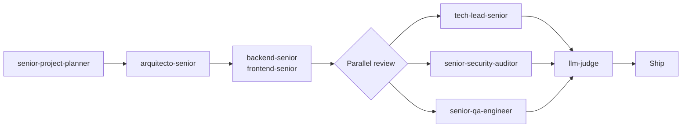
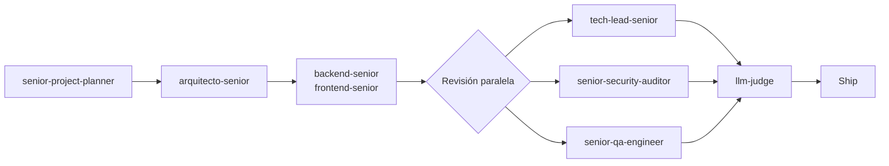

# Claude Skills — Senior Engineering Pipeline


[](https://github.com/cdgutierrez6/claude-skills/actions/workflows/validate-skills.yml)


> **37 Claude Code skills** that turn a single prompt into a full senior engineering pipeline: planning, architecture, build, parallel review (tech lead + security + QA) and an independent LLM judge.

---

<details open>
<summary><h2>🇺🇸 English</h2></summary>

### What this is

A set of role-based skills for [Claude Code](https://claude.com/claude-code). Each one encodes how a specific senior role works — not a prompt snippet, but a full operating procedure with checklists, gates and refusal conditions.

They are designed to **talk to each other**: the planner hands off to the builders, the builders hand off to three reviewers running in parallel, and an independent judge audits the result before anything is called done.

### Pipeline



### Catalog

| Area | Skills |
|---|---|
| **Engineering core** | `senior-project-planner` · `arquitecto-senior` · `backend-senior` · `frontend-senior` · `tech-lead-senior` · `senior-qa-engineer` · `senior-security-auditor` · `llm-judge` · `technical-writer` · `performance-engineer` · `devops-cloud-senior` · `devops-hostinger-senior` |
| **Web & design** | `web-design-pro-2026` · `immersive-landing` · `ui-ux-pro-max` · `ux-senior` · `creative-frontend-max` |
| **AI & data** | `ai-engineer` · `rag-engineer` · `langchain-agent-engineer` · `mcp-engineer` · `event-driven-ai` · `data-engineer` · `n8n-automation-engineer` |
| **Product & growth** | `po-senior` · `growth-strategist-senior` · `copywriter-senior` · `saas-monetization-expert` · `analytics-measurement-senior` |
| **Discovery** | `innovation-pipeline` · `scanning-tech-signals` · `scanning-market-demand` · `scanning-funding-access` · `filtering-opportunities` · `analyzing-with-frameworks` · `structuring-projects` · `reporting-daily-brief` |

### Install

Requires [Claude Code](https://claude.com/claude-code).

**All 37 skills — macOS / Linux:**

```bash
git clone https://github.com/cdgutierrez6/claude-skills.git
mkdir -p ~/.claude/skills ~/.claude/templates
cp -r claude-skills/skills/* ~/.claude/skills/
cp -r claude-skills/templates/* ~/.claude/templates/
```

**All 37 skills — Windows (PowerShell):**

```powershell
git clone https://github.com/cdgutierrez6/claude-skills.git
New-Item -ItemType Directory -Force "$env:USERPROFILE\.claude\skills", "$env:USERPROFILE\.claude\templates" | Out-Null
Copy-Item -Recurse -Force claude-skills\skills\* "$env:USERPROFILE\.claude\skills\"
Copy-Item -Recurse -Force claude-skills\templates\* "$env:USERPROFILE\.claude\templates\"
```

> Copia **también `templates/`**: los marketing skills (`growth-strategist-senior`,
> `copywriter-senior`, `analytics-measurement-senior`) leen de ahí su esquema de intake y la
> definición de la métrica. Sin esa carpeta funcionan, pero a ciegas.

**Just one skill:**

```bash
cp -r claude-skills/skills/tech-lead-senior ~/.claude/skills/
```

**Verify the install actually worked** — from the cloned repo:

```bash
python scripts/verify_install.py
```

It compares the repo against `~/.claude/skills`, so it catches a half-finished copy: missing skills, folders copied without their `SKILL.md`, and missing `templates/`. Use `--target` if you installed somewhere else. "I copied them" is not a verification.

**Then restart Claude Code.** Each skill is discovered from its `description` and fires when the task matches it — you do not have to memorize names. You can also ask for one explicitly:

```
use tech-lead-senior to review this PR
```

**Update:**

```bash
cd claude-skills && git pull && cp -r skills/* ~/.claude/skills/
```

**Uninstall:** delete the folders you copied from `~/.claude/skills/`. Nothing else is touched.

> **Scope** — `~/.claude/skills/` makes them available in every project. To limit them to one repo, copy into `<repo>/.claude/skills/` instead.
>
> **Layout** — every skill is `<name>/SKILL.md` (uppercase, exact) with YAML frontmatter carrying `name` and `description`. Filename case matters on Linux and macOS.

### Design principles

- **Proportional process** — trivial edits go direct; features get a light pipeline; risky work (new project, DB schema, payments) gets the full one.
- **Critical partner, not yes-man** — every review skill is written to disagree with reasons and propose a concrete alternative.
- **Maintainability is a gate, not a wish** — "it compiles" is not the deliverable. Code any human can open in a year and understand is.
- **Never delete core silently** — removing or reducing existing behavior is a product decision, never cleanup.
- **Verify by running** — nothing is "done" without executing it.

### Notes

- Written mostly in **Spanish (es-CO)**, which is the language they were designed to operate in. The method transfers; the prose is Spanish.
- Some skills reference the author's own projects as worked examples. No third-party client data is included.
- Third-party skills the author uses but did not write (e.g. `gstack`, `graphify`) are **not** redistributed here — get them from their own authors.
- A handful of skills cite commands, rules and notes that live outside this repo. **[`COMPATIBILIDAD.md`](COMPATIBILIDAD.md) documents every single one** and what to use instead — read it once after installing and nothing will be a mystery.

### Validation

Every push and PR runs these on Linux (case-sensitive filesystem, so a lowercase `skill.md` fails there even if it works on Windows):

- [`scripts/test_validators.py`](scripts/test_validators.py) — **22 tests of the validators themselves**, run first. Each injects a failure mode taken from a real bug in this repo and demands it be caught, plus control cases that must *not* be flagged. A validator that always passes is worse than no validator.
- [`scripts/validate_skills.py`](scripts/validate_skills.py) — each skill has a `SKILL.md` (exact case), valid YAML frontmatter, a `name` matching its folder, and a `description` long enough to be triggerable.
- [`scripts/validate_external_refs.py`](scripts/validate_external_refs.py) — every external reference (a command, a `REGLA #N`, a `[[note]]` that lives outside this repo) is explained in [`COMPATIBILIDAD.md`](COMPATIBILIDAD.md). Without this the doc would age silently and the gaps would come back unnoticed.

Run both before opening a PR:

```bash
pip install pyyaml
python scripts/validate_skills.py && python scripts/validate_external_refs.py
```

</details>

---

<details>
<summary><h2>🇨🇴 Español</h2></summary>

### Qué es esto

Un conjunto de skills por rol para [Claude Code](https://claude.com/claude-code). Cada una codifica cómo trabaja un rol senior concreto — no es un fragmento de prompt, sino un procedimiento completo con checklists, gates y condiciones de rechazo.

Están diseñadas para **hablarse entre ellas**: el planner entrega a los constructores, los constructores entregan a tres revisores en paralelo, y un juez independiente audita el resultado antes de dar nada por terminado.

### Pipeline



### Catálogo

| Área | Skills |
|---|---|
| **Núcleo de ingeniería** | `senior-project-planner` · `arquitecto-senior` · `backend-senior` · `frontend-senior` · `tech-lead-senior` · `senior-qa-engineer` · `senior-security-auditor` · `llm-judge` · `technical-writer` · `performance-engineer` · `devops-cloud-senior` · `devops-hostinger-senior` |
| **Web y diseño** | `web-design-pro-2026` · `immersive-landing` · `ui-ux-pro-max` · `ux-senior` · `creative-frontend-max` |
| **IA y datos** | `ai-engineer` · `rag-engineer` · `langchain-agent-engineer` · `mcp-engineer` · `event-driven-ai` · `data-engineer` · `n8n-automation-engineer` |
| **Producto y growth** | `po-senior` · `growth-strategist-senior` · `copywriter-senior` · `saas-monetization-expert` · `analytics-measurement-senior` |
| **Discovery** | `innovation-pipeline` · `scanning-tech-signals` · `scanning-market-demand` · `scanning-funding-access` · `filtering-opportunities` · `analyzing-with-frameworks` · `structuring-projects` · `reporting-daily-brief` |

### Instalación

Requiere [Claude Code](https://claude.com/claude-code).

**Las 37 skills — macOS / Linux:**

```bash
git clone https://github.com/cdgutierrez6/claude-skills.git
mkdir -p ~/.claude/skills ~/.claude/templates
cp -r claude-skills/skills/* ~/.claude/skills/
cp -r claude-skills/templates/* ~/.claude/templates/
```

**Las 37 skills — Windows (PowerShell):**

```powershell
git clone https://github.com/cdgutierrez6/claude-skills.git
New-Item -ItemType Directory -Force "$env:USERPROFILE\.claude\skills", "$env:USERPROFILE\.claude\templates" | Out-Null
Copy-Item -Recurse -Force claude-skills\skills\* "$env:USERPROFILE\.claude\skills\"
Copy-Item -Recurse -Force claude-skills\templates\* "$env:USERPROFILE\.claude\templates\"
```

> Copia **también `templates/`**: los skills de marketing (`growth-strategist-senior`,
> `copywriter-senior`, `analytics-measurement-senior`) leen de ahí su esquema de intake y la
> definición de la métrica. Sin esa carpeta funcionan, pero a ciegas.

**Una sola skill:**

```bash
cp -r claude-skills/skills/tech-lead-senior ~/.claude/skills/
```

**Verifica que la instalación quedó de verdad** — desde el repo clonado:

```bash
python scripts/verify_install.py
```

Compara el repo contra `~/.claude/skills`, así que detecta una copia a medias: skills que faltan, carpetas copiadas sin su `SKILL.md`, y `templates/` ausente. Usa `--target` si instalaste en otro sitio. "Ya las copié" no es una verificación.

**Luego reinicia Claude Code.** Cada skill se descubre por su `description` y se dispara sola cuando la tarea coincide — no hay que memorizar nombres. También puedes pedirla explícitamente:

```
usa tech-lead-senior para revisar este PR
```

**Actualizar:**

```bash
cd claude-skills && git pull && cp -r skills/* ~/.claude/skills/
```

**Desinstalar:** borra de `~/.claude/skills/` las carpetas que copiaste. No se toca nada más.

> **Alcance** — `~/.claude/skills/` las deja disponibles en todos los proyectos. Para limitarlas a un solo repo, cópialas en `<repo>/.claude/skills/`.
>
> **Estructura** — cada skill es `<nombre>/SKILL.md` (mayúsculas, exacto) con frontmatter YAML que lleva `name` y `description`. En Linux y macOS las mayúsculas del nombre de archivo importan.

### Principios de diseño

- **Proceso proporcional al riesgo** — la edición trivial va directa; una feature lleva pipeline liviano; lo caro o irreversible (proyecto nuevo, schema de DB, pagos) lleva el completo.
- **Socio crítico, no asistente complaciente** — toda skill de revisión está escrita para discrepar con razones y proponer la alternativa concreta.
- **La mantenibilidad es un gate, no un deseo** — "compila" no es el entregable. Código que cualquier humano abra en un año y entienda, sí.
- **Nunca borrar el core en silencio** — quitar o reducir algo existente es decisión de producto, jamás "pulido".
- **Verificar ejecutando** — nada está "hecho" sin correrlo.

### Notas

- Escritas mayormente en **español (es-CO)**, que es el idioma en el que fueron diseñadas para operar. El método se transfiere; la prosa es en español.
- Algunas skills citan proyectos propios del autor como ejemplos trabajados. No se incluye ningún dato de clientes de terceros.
- Las skills de terceros que el autor usa pero no escribió (p. ej. `gstack`, `graphify`) **no** se redistribuyen aquí — consíguelas de sus autores.
- Algunas skills citan comandos, reglas y notas que viven fuera de este repo. **[`COMPATIBILIDAD.md`](COMPATIBILIDAD.md) las documenta todas** y con qué sustituirlas — léelo una vez tras instalar y no te queda ningún hueco.

### Validación

Cada push y cada PR corre esto sobre Linux (filesystem case-sensitive, así que un `skill.md` en minúscula falla ahí aunque funcione en Windows):

- [`scripts/test_validators.py`](scripts/test_validators.py) — **22 tests de los propios validadores**, y van primero. Cada uno inyecta un modo de fallo sacado de un bug real de este repo y exige que se detecte, más casos de control que *no* deben marcarse. Un validador que siempre pasa es peor que no tener validador.
- [`scripts/validate_skills.py`](scripts/validate_skills.py) — cada skill tiene su `SKILL.md` (mayúsculas exactas), frontmatter YAML válido, un `name` que coincide con su carpeta y una `description` lo bastante larga como para poder dispararse.
- [`scripts/validate_external_refs.py`](scripts/validate_external_refs.py) — toda referencia externa (un comando, una `REGLA #N`, una `[[nota]]` que vive fuera de este repo) está explicada en [`COMPATIBILIDAD.md`](COMPATIBILIDAD.md). Sin esto el documento envejecería en silencio y los huecos volverían sin que salte ninguna alarma.

Corre las dos antes de abrir un PR:

```bash
pip install pyyaml
python scripts/validate_skills.py && python scripts/validate_external_refs.py
```

</details>
